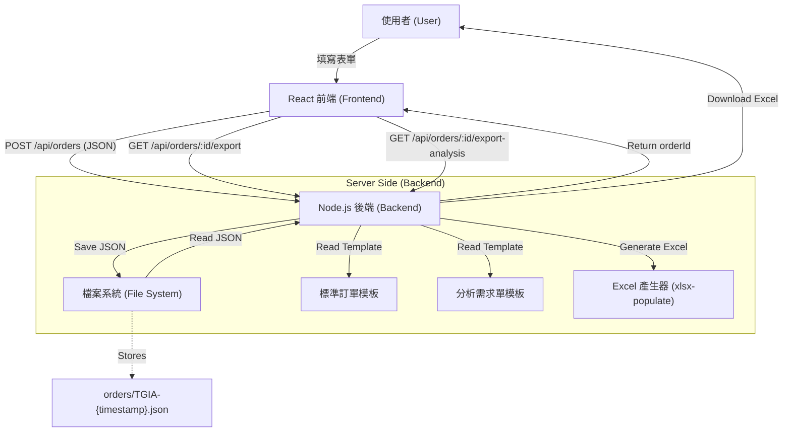

# TGIA Order System

這是一個無資料庫 (Database-less) 的訂單管理系統，專為 TGIA 設計。使用者可填寫訂單並自動生成格式化的 Excel 報表，支援標準訂單與分析需求單兩種格式。

## 系統架構 (System Architecture)

本系統採用前後端分離架構，使用 **檔案系統 (File System)** 作為資料儲存媒介，無需傳統資料庫。



### 核心流程
1. **填寫訂單**: 使用者在前端填寫訂單資訊
2. **資料儲存**: 前端將資料發送至後端，儲存為 JSON 檔案 (`tgia-backend/orders/`)
3. **資料過濾**: 根據選擇的服務類型 (A204/A205/A206/A207)，自動過濾無關欄位
4. **報表生成**: 後端讀取 JSON 檔案，根據模板填入資料並保留格式
5. **檔案下載**: 生成的 Excel 檔案回傳給前端

## 專案結構 (Project Structure)

```
tgia-order-system/
├── src/                          # React 前端原始碼
│   ├── App.js                    # 主要應用程式邏輯
│   ├── index.css                 # 全域樣式 (Tailwind CSS)
│   ├── product_line.json         # 服務品項資料
│   ├── sales_codes.json          # 業務代碼資料
│   ├── customer_codes.json       # 客戶代碼資料
│   ├── common_packages.json      # 常用套組資料
│   ├── support_species.json      # 支援物種資料
│   └── units.json                # 單位資料
├── tgia-backend/                 # Node.js 後端
│   ├── server.js                 # 伺服器入口點 (Express)
│   ├── routes/
│   │   └── analysis-export-populate.js  # 分析需求單匯出路由
│   ├── orders/                   # [自動生成] 儲存訂單 JSON 檔案
│   └── templates/                # Excel 模板存放處
│       ├── order_template.xlsx               # 標準訂單模板
│       └── TGIA分析需求單_v.20251201.xlsx   # 分析需求單模板
├── package.json                  # 前端依賴設定
└── README.md                     # 本文件
```

## 功能特色 (Features)

### 前端功能
- **多步驟表單**: 由 Step 0 至 Step 4 的漸進式填寫流程
- **業務/客戶代碼**: 自動帶入對應資訊
- **服務類別選擇**: 支援萃取/QC、建庫、定序、分析、套組等服務
- **智慧驗證**: 
  - 欄位必填檢查
  - 樣本名稱重複檢查
  - 定序量限制檢查
  - RNAseq 分析物種檢查
  - 分析組別一致性檢查
- **Excel 上傳**: 支援直接上傳 Excel 檔案快速填入樣本資料
- **即時預覽**: Step 4 提供完整訂單預覽
- **雙重匯出**: 
  - 標準訂單 Excel
  - 分析需求單 Excel (僅分析服務)

### 後端功能
- **JSON 資料儲存**: 所有訂單以檔案形式儲存
- **Excel 報表生成**: 使用 `xlsx-populate` 保留模板格式
- **智慧資料映射**: 
  - 標準欄位映射
  - 分析需求欄位映射 (customRequirements, comparisonGroups, deParams)
  - 物種資訊映射 (支援"其他"物種的學名與參考基因組)
- **CORS 支援**: 允許跨域請求

## 安裝與執行 (Installation & Usage)

本專案包含前端與後端，建議分別開啟兩個終端機視窗來執行。

### 1. 啟動後端 (Backend)

```bash
cd tgia-backend
npm install
node server.js
```
後端預設運行於 `http://localhost:3001`。

### 2. 啟動前端 (Frontend)

```bash
# 回到根目錄
npm install
npm start
```
前端預設運行於 `http://localhost:3002`。

## 技術堆疊 (Tech Stack)

- **Frontend**: React, Tailwind CSS, Lucide Icons
- **Backend**: Node.js, Express
- **Data Storage**: JSON Files (Local File System)
- **Excel Processing**: 
  - `exceljs` (標準訂單)
  - `xlsx-populate` (分析需求單 - 避免格式損壞)

## API 端點 (API Endpoints)

### POST /api/orders
提交訂單資料，儲存為 JSON 檔案。

**Request Body**: JSON 格式的完整訂單資料

**Response**: 
```json
{
  "success": true,
  "orderId": "TGIA-1234567890123"
}
```

### GET /api/orders/:orderId/export
匯出標準訂單 Excel 檔案。

### GET /api/orders/:orderId/export-analysis
匯出分析需求單 Excel 檔案（僅當訂單包含分析服務時）。

## 資料過濾規則 (Data Filtering Rules)

系統會根據選擇的分析服務代碼自動過濾 `analysisRequirements` 欄位：

- **A204**: `comparisonGroups = []`, `deParams = { logFC: '', pMethod: '', pCutoff: '' }`, `customRequirements = ''`
- **A205**: `customRequirements = ''`
- **A206**: `comparisonGroups = []`, `deParams = { logFC: '', pMethod: '', pCutoff: '' }`
- **A207**: 保留所有欄位

## 注意事項 (Notes)

- **資料備份**: 所有訂單資料儲存於 `tgia-backend/orders/`，請定期備份
- **模板修改**: 修改 Excel 輸出格式時，需同步更新對應的映射邏輯
- **Git 忽略**: `tgia-backend/orders/` 已加入 `.gitignore`，不會提交至版本控制
- **物種選擇**: RNAseq 分析必須選擇物種，選擇"其他"時需填寫俗名與學名
- **樣本來源**: 如樣本來自舊訂單，請在「樣本來源」欄位填入舊訂單 PO 號碼

## 開發指南 (Development Guide)

### 新增服務品項
編輯 `src/product_line.json`，在對應類別下新增服務項目。

### 新增業務/客戶代碼
編輯 `src/sales_codes.json` 或 `src/customer_codes.json`。

### 修改 Excel 映射
- 標準訂單: 編輯 `tgia-backend/server.js` 中的 `/api/orders/:orderId/export` 端點
- 分析需求單: 編輯 `tgia-backend/routes/analysis-export-populate.js`

## 版本歷史 (Version History)

### v2.0 (2025-11-20)
- 新增分析需求單匯出功能
- 使用 `xlsx-populate` 解決 Excel 格式損壞問題
- 新增 RNAseq 分析物種選擇與驗證
- 新增參考基因組欄位 (`speciesOtherReferenceGenome`)
- 優化 UI/UX (移動重新填寫按鈕位置)
- 新增樣本來源提示與 placeholder

### v1.0 (Initial Release)
- 基礎訂單系統
- 標準 Excel 匯出功能
